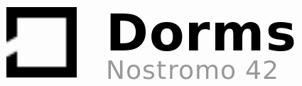

# Nostromo Dorms - 42 Silicon Valley

[](https://github.com/facebook/react/releases/tag/v16.3.2)
[](https://github.com/jraleman/nostromo-dorms/stars)
[](https://github.com/jraleman/nostromo-dorms/issues)
[](https://42siliconvalley.slack.com)



## About

This is a react.js web application used as the dorm's website for 42
Silicon Valley School.

Take a look at: [https://dorms.42.us.org](https://dorms.42.us.org)

## Setup

Clone the repository:

```
git clone https://github.com/jraleman/nostromo-dorms nostromo-dorms
cd nostromo-dorms
```

Install all the dependencies needed:

```
npm install
```

Start the development server:

```
npm start
```

Then open a browser and go to `localhost:3000`.

## Dependencies

This project uses the following technologies:

- Bootstrap
- Google Maps
- Font Awesome
- Animsition
- Cheet.js
- Smoothscroll
- jQuery
  - jQuery.fullPage
  - jQuery.lazyloadanything
  - jQuery.pagepilling

Thanks to these teams, the world is a better place :)

## Project Structure

The idea of having a good project structure is to have a cross platform
project, to maximize code reuse, keep the configurations out of the code,
and minimize the component state.

This is the main idea for the source code:

```
src
├── components/
│   ├── Button/
│   │   ├── Button.js
│   │   └── index.js
|  ...
│   └── Header/
│       ├── Header.js
│   │   └── index.js
├── containers/
│   ├── BannerContent/
│   │   ├── BannerContent.js
│   │   └── index.js
|  ...
│   └── FacilitiesBackground/
│       ├── FacilitiesBackground.js
│   │   └── index.js
├── i18n/
|   ├── i18n.js
|   ├── index.js
|   └── languages/
|       ├── de.json
|       ├── en.json
|      ...
|       └── pt.json
├── images/
│   ├── bg
│   │   ├── backyard.jpg
|   |  ...
│   │   └── rooms.jpg
│   ├── logo
│   │   ├── logo.png
│   │   └── logo-white.png
│   ├── modal
│   │   ├── happy.jpg
|   |  ...
│   │   └── volleyball.jpg
│   └── placeholder.jpg
└── sections/
    ├── Banner/
    │   ├── Banner.js
    │   └── index.js
   ...
    └── FAQ/
        ├── FAQ.js
        └── index.js
```

The public directory contains all the styles and state-less components scripts:

```
public/
├── css
│   ├── bootstrap.css
|  ...
│   └── style.css
├── favicon.ico
├── fonts
│   ├── fontawesome-webfont3e6e.eot
|  ...
│   └── poppins-regular-webfont.woff2
├── index.html
├── js
│   ├── bootstrap.min.js
|  ...
│   └── scripts.js
└── manifest.json

```

## Style Guide

### Code

This project follows the `semistandard`, which is just the `standard` style
guide, but including semicolons `;` at the end of a statement. This is because
love the C programming languages, and semicolons are awesome.

#### Lint

After running `npm install`, you can run the following scripts (depending on
your platform), to check if the code follows the `semistandard` coding
style guide.

| Mac OS X           | Linux                    | Description                 |
| :----------------- | :----------------------- | :-------------------------- |
| `npm run lint`     | `npm run lint`           | Checks `src/` code style    |
| `npm run lint-log` | `npm run lint-log-linux` | Saves and open the log file |

If you have any problem running the lint from the project, try installing the
following packages globally, like this:

```
npm install --save snazzy
npm install --save semistandard
```

And then just run the lint from your end.

### Design

Anything related to graphic design, such as colors, fonts,
metrics... goes here.

#### Colors


## TODO

- [x] Create repo :)
- [x] Make mockups
- [x] Complete html structure
- [x] Finish static front-end
- [x] Take photos
- [x] Install React
- [x] Create sections
- [x] Create containers
- [x] Create components
- [ ] Integrate i18n to React
- [ ] Add Google Maps react component
- [ ] Finish documentation
- [ ] Make demo gif

### To Fix (A Bugs' Life)

- Duplicated navigation indicator (right-side nav circles).
- Responsive (mobile) version, the isn't visible.

## Extras

Just for fun!

### Easter Eggs

- Konami code. `8-)`
- My cat. `:3`
- Kwame's dog. `:<`
- Best dish in the history of mankind. `:)`

## Acknowledgment

This project uses the following assets:

### [Paul Theme's Banhaus](http://paul-themes.com/html/bauhaus/preview/).

This is a really awesome theme. It's very well organized and documented.

- Theme icon as project icon.

## Support me!

It means a lot to me! :)

### Contribute

I really, really appreciate any contribution, as long as me and 42 School
Silicon Valley school accepts the pull request. If you need help on how to
get started, please follow this [guideline](resources/pr-guideline.md).

### Hire me

If you are looking for a designer, developer, or engineer, I might be
available to help you out, or to provide my services.
I am always up for any new challenge! :D

Just contact me and let's see how I can help you out! :)

## License

This project is under the MIT License. Meaning that you can use, copy, modify,
merge, publish, distribute, sub-license, and/or sell copies of the final
products. See the [LICENSE](LICENSE) file for more details.
